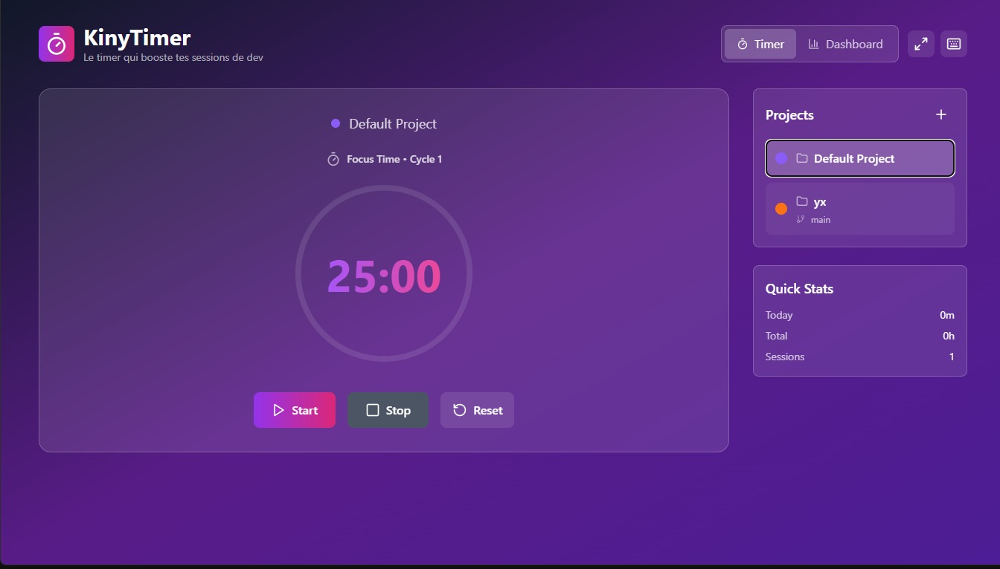

# ⏱️ KinyTimer

**KinyTimer** est une application de productivité minimaliste conçue pour les développeurs. Elle permet de suivre précisément le temps passé sur chaque projet grâce à une interface propre, un mode zen, des raccourcis clavier, et une intégration directe avec GitHub et Git local.

---

## 🚀 Fonctionnalités

- 🧘‍♂️ **Mode Zen** : interface épurée pour un focus total
- ⌨️ **Raccourcis clavier** : contrôle global du timer (start, pause, reset, etc.)
- 🐙 **Intégration GitHub** : suivi du temps par projet Git, commit actif, branche courante
- 📊 **Dashboard** : heatmap à la GitHub, statistiques, export JSON/Markdown
- 📝 **Logs de session** : export des sessions en `.md` ou `.json`
- 🔌 **Electron App** : application de bureau multi-plateforme

---

## 📸 Aperçu

 

---

## 🧪 Stack technique

- **Electron.js** – pour l'app desktop
- **React** + **TailwindCSS** – interface utilisateur
- **Node.js** + **LowDB** – backend local rapide et léger
- **simple-git** – intégration Git locale
- **GitHub API** – pour enrichir les données projet

---

## ⚙️ Installation

### 1. Clone le repo

```bash
git clone https://github.com/tonpseudo/KinyTimer.git
cd KinyTimer
